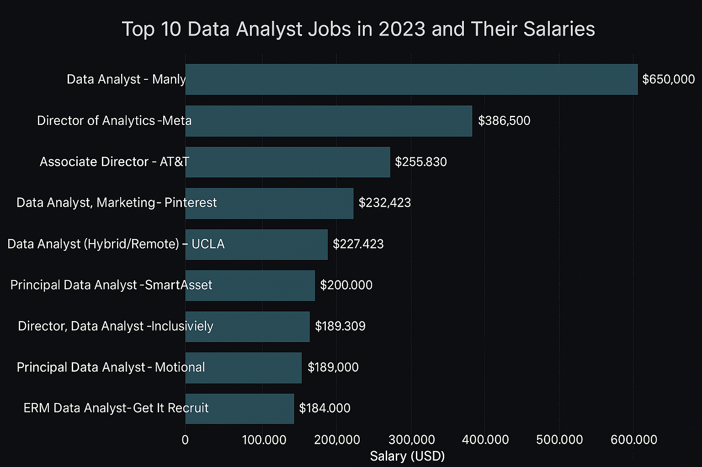
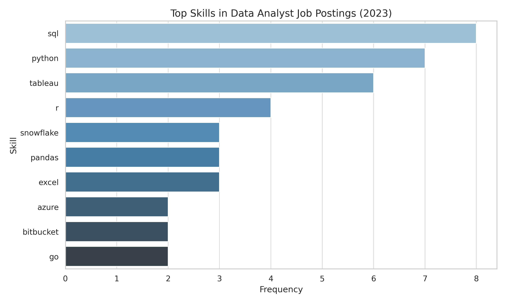

 # Introduction
📊✨ Step into the world of data analytics! This project dives into data analyst roles, spotlighting 💼 top-paying jobs, 🚀 in-demand skills, and 📈 where booming demand meets high salaries.

🔍 SQL queries? Check them out here: [project_sql folder](/project_sql/)

 # Background
The data analytics job market is evolving rapidly as businesses seek professionals who can turn data into actionable insights. In this project, we analyze real job postings to uncover patterns in salaries, required skills, and industry demand for data analysts.  

**Data Source:** Provided in Luke Barousse's SQL course. More info: [Kaggle link](https://lukebarousse.com/sql).

This analysis aims to guide aspiring data analysts by highlighting what employers are looking for and where the most promising opportunities are found.

**Key questions addressed:**
1. What are the top-paying data analyst jobs?
2. What skills are required for the top-paying data analyst jobs?
3. What are the most in-demand skills for data analysts?
4. What are the top skills based on salary?
5. What are the most optimal skills to learn (high demand and high-paying)?

 
 # Tools used
- **SQL:**  
  Developed queries to extract, filter, and analyze job posting data for insights on salaries, skills, and industry trends.

- **PostgreSQL:**  
  Used as the main database system to store and manage the datasets for analysis.
  
- **Visual Studio Code:**  
  Main workspace for writing SQL scripts, organizing files, and documenting the project.

- **Git & GitHub:**  
  Used for version control and collaboration, allowing me to track changes and share the project.

 
 # The Analysis
 ### 1. Identifying Top-Paying Data Analyst Jobs

To find the top-paying data analyst jobs, I selected the 10 highest-paying remote ("Anywhere") data analyst roles with specified salaries.

**Query used:**
```sql
SELECT
    job_id,
    job_title,
    job_location,
    job_schedule_type,
    salary_year_avg,
    job_posted_date,
    name AS company_name
FROM
    job_postings_fact
LEFT JOIN company_dim
    ON job_postings_fact.company_id = company_dim.company_id
WHERE
    job_title_short = 'Data Analyst'
    AND job_location = 'Anywhere'
    AND salary_year_avg IS NOT NULL
ORDER BY
    salary_year_avg DESC
LIMIT 10;
```

**Breakdown:**
- **Salary range:** The top 10 remote data analyst jobs offered average annual salaries from approximately $650,000 down to $184,000.


- **Diverse employers:** These roles were offered by companies such as SmartAsset, Mantys, Meta, and AT&T, showing that top salaries are available across different industries.
  
- **Job schedule:** All positions were remote, providing flexibility and access to high salaries regardless of location.

- **Posting dates:** The jobs were posted throughout 2023, showing strong ongoing demand for remote data analyst talent.

 
*The chart above, is generated with guidance from ChatGPT, visually compares the top 10 remote data analyst jobs in 2023 by salary and company*


### 2. Top-Paying Data Analyst Job Skills
To identify which skills are most associated with the highest-paying data analyst jobs, I analyzed the skills required for the top-paying roles.

```sql
WITH top_paying_jobs AS (
    SELECT
        job_id,
        job_title,
        salary_year_avg,
        name AS company_name
    FROM
        job_postings_fact
    LEFT JOIN company_dim
        ON job_postings_fact.company_id = company_dim.company_id
    WHERE
        job_title_short = 'Data Analyst'
        AND job_location = 'Anywhere'
        AND salary_year_avg IS NOT NULL
    ORDER BY
        salary_year_avg DESC    
)
SELECT top_paying_jobs.*,
       skills
FROM 
    top_paying_jobs
INNER JOIN skills_job_dim
    ON top_paying_jobs.job_id = skills_job_dim.job_id
INNER JOIN skills_dim
    ON skills_job_dim.skill_id = skills_dim.skill_id
ORDER BY 
    salary_year_avg DESC
    LIMIT 10;
```
**Breakdown:**
- **SQL** leads with **8**, making it the most demanded skill among top-paying roles.
- **Python** (**7**) and **Tableau** (**6**) are also highly sought after.
- Other key skills include R, Snowflake, Excel, Pandas, Bitbucket and Go that show varying degrees of demand.




*The bar graph above, generated with guidance from ChatGPT, shows the most common skills required for the highest-paying remote data analyst jobs in 2023.*


### 3. Most In-Demand Skills for Data Analysts

To uncover the most in-demand skills for data analysts, I analyzed all remote data analyst job postings and counted how often each skill appeared.

```sql
SELECT skills,
       COUNT(job_postings_fact.job_id) AS demand_count
FROM job_postings_fact
INNER JOIN skills_job_dim
    ON job_postings_fact.job_id = skills_job_dim.job_id
INNER JOIN skills_dim
    ON skills_job_dim.skill_id = skills_dim.skill_id
WHERE job_title_short = 'Data Analyst'
  AND job_work_from_home = 'True'
GROUP BY skills
ORDER BY demand_count DESC
LIMIT 5;
```

Here is the breakdown of the most demanded skills for data anlysts in 2023.
- **SQL and Excel** are the most in-demand skills for data analysts, forming the backbone of data extraction, manipulation, and reporting in the industry.
- **Programming and visualization tools** such as **Python, Tableau, and Power BI** are in high demand because they help automate data tasks, perform complex analyses, and create easy-to-understand visual reports that support better  decisions.

| Skill     | Demand Count |
|-----------|--------------|
| SQL       | 7,291        |
| Excel     | 4,611        |
| Python    | 4,330        |
| Tableau   | 3,745        |
| Power BI  | 2,609        

*This table highlights the top 5 most in-demand skills for data analysts in 2023.*


### 4. Top Skills Based on Salary

To determine which skills are most associated with higher salaries for data analysts, I analyzed the average salaries for job postings requiring each skill.

```sql
SELECT
    skills,
    ROUND(AVG(salary_year_avg), 0) AS avg_salary
FROM job_postings_fact
INNER JOIN skills_job_dim
    ON job_postings_fact.job_id = skills_job_dim.job_id
INNER JOIN skills_dim
    ON skills_job_dim.skill_id = skills_dim.skill_id
WHERE job_title_short = 'Data Analyst'
  AND salary_year_avg IS NOT NULL
GROUP BY skills
ORDER BY avg_salary DESC
LIMIT 5;
```
**Breakdown of Top-Paying Skills for Data Analyst Roles (2023):**

- 🧠 **Big Data & Machine Learning Tools:**  
  Skills like **PySpark** and **DataRobot** are highly rewarded, reflecting the premium placed on advanced analytics and handling large-scale data.

- 🛠️ **DevOps & Engineering Skills:**  
  Experience with **Bitbucket** boosts salaries, as it enables collaboration and efficient deployment in data projects.

- ☁️ **Cloud & Modern Data Platforms:**  
  Proficiency in **Couchbase** and **Watson** is linked to higher pay, showing the value of cloud-native and AI-driven data solutions.

| Skill      | Average Salary ($) |
|------------|-------------------|
| PySpark    | 208,172           |
| Bitbucket  | 189,155           |
| Couchbase  | 160,515           |
| Watson     | 160,515           |
| DataRobot  | 155,486           |

*Table of top 5 skills associated with the highest average salaries for data analyst roles in 2023.*


### 5. Most Optimal Skills to Learn (High Demand & High-Paying)

Combining insights from demand and salary data, this query aimed to identify the skills that are both highly sought after and linked to the highest salaries for data analysts.

```sql
SELECT skills_dim.skill_id,
       skills,
       count(skills_job_dim.job_id) AS demand_count,
       Round (AVG(job_postings_fact.salary_year_avg), 0) AS avg_salary
FROM job_postings_fact
INNER JOIN skills_job_dim
    ON job_postings_fact.job_id = skills_job_dim.job_id
INNER JOIN skills_dim
    ON skills_job_dim.skill_id = skills_dim.skill_id
WHERE job_title_short = 'Data Analyst' 
      AND salary_year_avg IS NOT NULL 
      AND job_work_from_home = 'True'
GROUP BY skills_dim.skill_id, skills
HAVING count(skills_job_dim.job_id) > 10
ORDER BY avg_salary DESC, 
         demand_count DESC
LIMIT 25;
```

| Skill ID | Skill       | Demand Count | Avg Salary ($) |
|----------|-------------|--------------|---------------|
| 8        | go          | 27           | 115,320       |
| 234      | confluence  | 11           | 114,210       |
| 97       | hadoop      | 22           | 113,193       |
| 80       | snowflake   | 37           | 112,948       |
| 74       | azure       | 34           | 111,225       |
| 77       | bigquery    | 13           | 109,654       |
| 76       | aws         | 32           | 108,317       |
| 4        | java        | 17           | 106,906       |
| 194      | ssis        | 12           | 106,683       |
| 233      | jira        | 20           | 104,918       |

*Table of the most optimal skills for data analysts sorted by salary*
#### Breakdown of the Most Optimal Skills for Data Analysts in 2023

---

#### 1. High_Demand Programming Languages  
**Skills:** Python, R, Go, Java, C++  
**Salary Range:** $98,958 – $115,320  
These languages are essential for data manipulation, analytics, automation, and building scalable solutions. Python and R are especially in high demand, while Go and Java offer higher salary potential for specialized roles.

---

#### 2. Cloud & Big Data Platforms  
**Skills:** Snowflake, Azure, AWS, BigQuery, Hadoop, Spark, Redshift  
**Salary Range:** $99,077 – $113,193  
Cloud and big data platforms are crucial for handling, storing, and analyzing large datasets. Mastery of these tools is highly valued in modern data analytics environments.

---

#### 3. Business Intelligence & Visualization Tools 
**Skills:** Tableau, Looker, Qlik, SSRS  
**Salary Range:** $99,171 – $103,795  
BI and visualization tools are key for turning data into actionable insights. Tableau and Looker are especially in demand, helping analysts communicate findings effectively.

---

#### 4. Databases Technologies & Data Management  
**Skills:** Oracle, SQL Server, NoSQL, SSIS  
**Salary Range:** $97,786 – $106,683  
Strong database and data management skills ensure efficient data storage, retrieval, and integration—core to any data analyst’s toolkit.


---
**Summary:**
To boost your data analyst career, master key programming languages, cloud/big data tools, BI platforms, and database management. This skill mix opens doors to top jobs and higher salaries.


 # What I learned
During this project, I strengthened my technical and analytical skills. Key takeaways:

- 🧩 **Complex query crafting:** Used advanced SQL commands to extract and join job and skill data from multiple tables.
- 📈 **Data aggregation:** Applied SQL aggregation functions (like `COUNT`, `AVG`, `GROUP BY`) to summarize demand and salary trends.
- 🔍 **Analytical wizardry:** Turned raw SQL query results into actionable insights for aspiring data analysts.
 
# Conclusions

### The Insights

1. **Top-paying jobs**: The highest remote data analyst salaries reached up to $650,000, showing strong earning potential across industries.
2. **Skills for top-paying jobs**: Advanced proficiency in SQL is a required skill among the highest-paying data analyst roles in the job market.
3. **Most in-demand skill**: SQL is also the most frequently requested skill in data analyst job postings, making it essential for anyone entering the field.
4. **Skills linked to higher salaries**:Specialized skills like PySpark and Couchbase are tied to the highest average salaries, showing a premium for niche expertise in the data analyst job market.
5. **Most optimal skill to learn**: SQL leads when balancing both demand and salary—mastering it opens the door to more and better opportunities.

### Closing Thoughts
This project enhanced my SQL skills and provided valuable insights into the data analyst job market. It highlighted the importance of strong foundational abilities, adaptability, and continuous learning for long-term career growth. By understanding current trends and focusing on in-demand skills, you can stay competitive and unlock top opportunities in the evolving world of data analytics.
